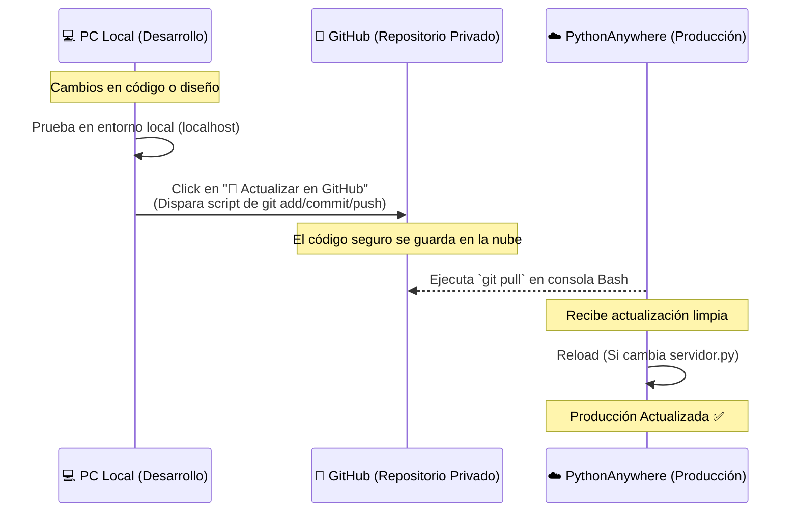

# 🌟 Diario de Sesión Arquitectónica | Panel de Control Tuya IoT
> **Fecha:** 22 de Junio de 2026 | **Versión Alcanzada:** V2.1 🚀

---

## 🎯 Resumen Ejecutivo

> [!TIP]
> **Objetivo Principal Conseguido:** Estabilización de la comunicación bidireccional con el servicio en la nube de Tuya (especialmente dispositivos Infrarrojos), corrección de comandos de conmutación y creación de una infraestructura de despliegue automatizada `Local ➔ GitHub ➔ PythonAnywhere`.

En esta sesión, hemos transformado un prototipo funcional en una **solución robusta y desplegable**, resolviendo fallos críticos de sincronización de estado y construyendo herramientas para el desarrollo continuo.

---

## 🛠️ Resoluciones Técnicas y Bugfixes

### 1. ❄️ Aire Cris (Dispositivo Infrarrojo Virtual)
*   **🐛 Problema:** El dispositivo alternaba estados erróneamente en la UI (se "apagaba" solo).
*   **🔍 Causa:** `tinytuya.Cloud.getstatus()` no funciona para mandos IR virtuales, devolviendo siempre vacío.
*   **💡 Solución:** Implementación de la ruta específica de la API de Tuya para dispositivos IR:
    *   *Endpoint:* `/v2.0/infrareds/{infrared_id}/remotes/{remote_id}/ac/status`
*   **✅ Resultado:** Sincronización real bidireccional de parámetros (Power, Temp, Mode, Fan).

### 2. 🏊‍♂️ Relés de Piscina (Agua y Reloj)
*   **🐛 Problema:** Error `1109 (param is illegal)` al enviar comandos.
*   **🔍 Causa:** Estructura JSON incorrecta en la llamada a `tinytuya.Cloud.sendcommand()`.
*   **💡 Solución:** Empaquetar la lista de comandos dentro de la clave `{"commands": [...]}`.
*   **✅ Resultado:** Encendido y apagado instantáneo desde la interfaz web.

### 3. ☁️ Despliegue en PythonAnywhere (Errores 500)
*   **🐛 Problema:** `TemplateNotFound` y fallos al iniciar el servidor WSGI.
*   **🔍 Causa:**
    1.  Interferencia de `argparse` con los argumentos del proceso WSGI.
    2.  Ausencia de los directorios `/templates` y `/static` en el entorno cloud.
*   **💡 Solución:**
    *   Uso de `parser.parse_known_args()` en `servidor.py` para tolerancia a fallos.
    *   Creación de la estructura de directorios en el servidor.
*   **✅ Resultado:** Aplicación Flask estable y sirviendo vistas correctamente en la nube.

---

## 🎨 UI/UX y Experiencia de Usuario

> [!NOTE]
> **Filosofía de Diseño:** Inspirado en la App Móvil Oficial.

*   **🌫️ Sombreado de Controles Inactivos:** Implementada la lógica y la clase `.disabled-controls`. Cuando el Aire Acondicionado está apagado, su tarjeta entra en escala de grises y deshabilita la interacción, evitando clics fantasma.
*   **🏷️ Versionado Visible:** Añadido un `badge` dinámico indicando la **V 2.1** en el Header de la aplicación, mejorando la trazabilidad.

---

## 🚀 Arquitectura de Despliegue Implementada (GitOps)

Se ha creado un flujo de trabajo profesional para facilitar futuras actualizaciones sin mover archivos manualmente.

### 🔄 Diagrama del Flujo de Trabajo



### 🧰 Herramientas Creadas

1.  **`.gitignore`:** Seguridad total. Excluye `.env`, `.json` y temporales.
2.  **`agente_deploy.py`:** Un asistente de terminal interactivo que verifica el estado, pide confirmación y automatiza el push.
3.  **`Actualizacion_github.bat`:** El motor de git por debajo del agente.
4.  **`🚀 Actualizar Web.bat`:** Acceso directo para ejecutar el agente de despliegue con doble clic.
5.  **Botón UI Integrado:** Se ha incrustado el disparador del despliegue directamente en `landing.html` (Solo visible en modo `Local`).

---

## 🧩 Arquitectura del Backend Actualizada

```mermaid
graph TD
    A[Frontend UI] -->|Peticiones Async| B(Flask App - servidor.py)
    
    subgraph API Endpoints
    B --> C[/api/data]
    B --> D[/api/toggle]
    B --> E[/api/deploy]
    end
    
    C -->|Llamada Específica IR| F[Tuya Cloud API]
    C -->|Estado General| F
    D -->|Formato 'commands'| F
    
    E -->|Modo Local Solamente| G[Subproceso Git]
    G --> H[GitHub]
    
    style E fill:#f9f,stroke:#333,stroke-width:2px
```

---

## 📋 Próximos Pasos Recomendados

- [ ] **Monitorización:** Considerar añadir un archivo simple de logs (`app.log`) local para tener histórico de errores de comunicación con Tuya sin depender de la consola.
- [ ] **Escalabilidad UI:** Si se añaden más dispositivos IR en el futuro, refactorizar la lógica del Aire Cris para que sea reutilizable (un "controlador de dispositivos IR genérico").

---
*Sesión documentada por el Agente Experto en Arquitectura y Documentación de Antigravity.* ✨
